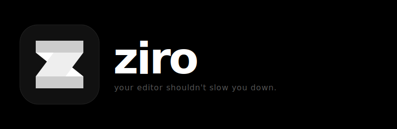

<div align="center">




</div>

---

Ziro is a featherlight, native text editor for Linux. No Electron. No web wrappers. No excuses.

It opens before you finish blinking. It gets out of your way.

---

## why

Every modern editor is either slow, bloated, or locked to macOS.

VSCode takes 3 seconds to open. Neovim takes a PhD to configure. Zed doesn't run on Linux properly. Sublime costs money.

Ziro is the editor that should have existed already — native, instant, and built for the developer who actually cares about their tools.

---

## goals

- **Sub-100ms cold launch.** Measured, not estimated.
- **Rope-based text engine.** Edits at any scale without copying the world.
- **Tree-sitter syntax highlighting.** Incremental, correct, fast.
- **LSP support.** Autocomplete, go-to-definition, diagnostics — the full deal.
- **Zero config to start.** Sane defaults. Customize when you want to, not before you can use it.
- **iPad companion.** Edit and view files over local network. Seamless.

---

## stack

| Layer | Tech |
|---|---|
| Language | Rust |
| UI framework | Tauri v2 |
| Frontend | Svelte + Vite |
| Text buffer | `ropey` |
| Syntax | `tree-sitter` |
| Config | `toml` + `serde` |
| Async | `tokio` |

---

## status

Ziro is in early development. Nothing is stable. Everything is being built.

- [x] Project scaffold
- [x] Native window
- [ ] Editor UI
- [ ] File open/save
- [ ] Syntax highlighting
- [ ] LSP integration
- [ ] Config system
- [ ] iPad companion

---

## building

```bash
git clone https://github.com/FaizeenHoque/ziro
cd ziro/ui && npm install
cd .. && cargo tauri dev
```

Requires Rust 1.78+ and Node 18+. That's it.

---

## license

MIT © 2026 Faizeen Hoque