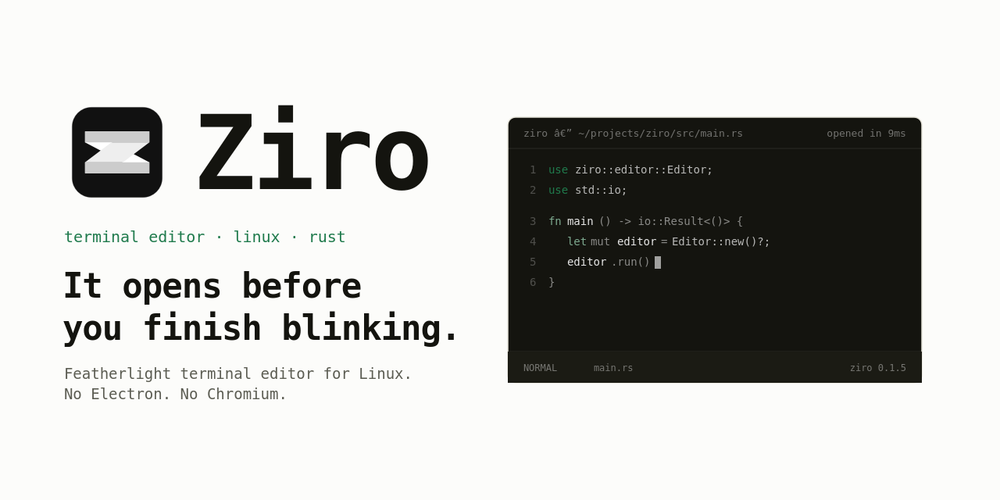

<div align="center">




</div>

---

Ziro is a featherlight terminal text editor (TUI) for Linux. No Electron. No Chromium. No unnecessary layers.

It opens before you finish blinking. It stays out of your way.

---

## why

Every modern editor makes you pay somewhere.

VSCode ships a whole browser to edit text. Neovim gives you unlimited power after a configuration ritual. Zed is promising but still finding its place on Linux. Sublime costs money.

Ziro is the editor that should have existed already — lightweight, instant, and built for developers who actually care about their tools.

---

## install

**Stable** — prebuilt binary, no Rust required:

```bash
curl -sSL https://ziro.faizeenhoque.dev/install.sh | bash
```

**Rolling** — builds from latest main, requires Cargo:

```bash
curl -sSL https://ziro.faizeenhoque.dev/install-rolling.sh | bash
```

> [!NOTE]
> Stable is recommended for most users. Rolling tracks the latest commit on main and may be unstable.

> [!WARNING]
> Both scripts require `sudo` to move the binary to `/usr/local/bin`. Read the script before running if you're cautious about piping curl to bash.

→ **[Full usage guide and keybinds](https://ziro.faizeenhoque.dev/docs/)**

---

## goals

* **Fast cold launch.** Measured, not estimated.
* **Native terminal experience.** Runs anywhere your shell does.
* **Rope-based text engine.** Edits at any scale without copying the world.
* **Tree-sitter syntax highlighting.** Incremental, correct, fast.
* **LSP support.** Autocomplete, go-to-definition, diagnostics — the full deal.
* **Zero config to start.** Sane defaults. Customize when you want to, not before you can use it.
* **Minimal resource usage.** A text editor should not need half your RAM.

## editor features

* **File explorer sidebar.** Browse folders in place and open files without leaving the editor.
* **Tabbed files.** Open files stay in a tab bar for quick switching and closing, and tabs can be reordered by dragging.
* **Drag-and-drop file moves.** Drag files or folders in the explorer to move them in place.
* **Filename prompt.** Saving an unnamed buffer opens a prompt so you can choose a path.
* **Undo / redo.** Consecutive edits are grouped into practical undo steps.
* **Status feedback.** Saves, cancels, and invalid actions surface in the status bar.

## keybindings

* **Ctrl+E** toggles the file explorer.
* **Ctrl+S** saves the current file or opens the filename prompt for a new buffer.
* **Ctrl+W** closes the current tab.
* **Ctrl+Alt+W** exits immediately when the buffer is clean.
* **Ctrl+Z** undoes the last change.
* **Ctrl+Shift+Z** redoes the last undone change.
* **Esc** cancels the filename prompt without saving.

---

## stack

| Layer       | Tech             |
| ----------- | ---------------- |
| Language    | Rust             |
| UI          | TUI (`ratatui`)  |
| Text buffer | `ropey`          |
| Syntax      | `tree-sitter`    |
| Config      | `toml` + `serde` |
| Async       | `tokio`          |

---

## status

> [!CAUTION]
> Ziro is in early development. Nothing is stable. Everything is being built. Do not use this as your daily driver yet.

* [x] Project scaffold
* [x] Terminal interface
* [x] Editor UI
* [x] File open/save
* [x] Syntax highlighting
* [ ] LSP integration
* [ ] Config system
* [ ] Plugin system

---

## building

```bash
git clone https://github.com/FaizeenHoque/ziro
cd ziro
cargo run
```

Requires Rust 1.78+. That's it.

---

## license

MIT © 2026 Faizeen Hoque
